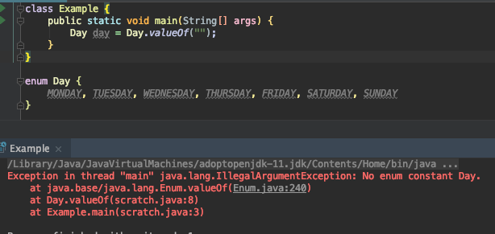
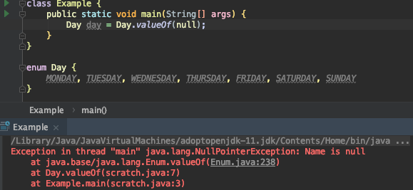

# 학습내용
- enum 정의하는 방법
- enum이 제공하는 메소드 (values()와 valueOf())
- java.lang.Enum
- EnumSet

 

## enum 정의하는 방법
- 상수들의 집합, 클래스
- enum 클래스를 정의하는 방법
  ~~~java
  enum 클래스명 {
    상수,...
  }
  
  enum Day {
    MONDAY, TUESDAY, WEDNESDAY, THURSDAY, FRIDAY, SATURDAY, SUNDAY
  }
  ~~~
- static final 로 선언하던 상수를 enum 클래스로 정의하여 사용하면 가독성 향상 및 상수 범위 제한 등의 이점이 존재
- enum 클래스이기 때문에 다른 클래스와 동일하게 Object를 상속받고 있음
- java doc에 따르면 Serializable, Comparable을 상속받고 있음

 

## enum이 제공하는 메소드 (values()와 valueOf())
- values()
  - enum 객체의 상수를 객체 배열 형태로 반환
  ~~~java
  class Example {
      public static void main(String[] args) {
          Day[] days = Day.values();
      }
  }

  enum Day {
      MONDAY, TUESDAY, WEDNESDAY, THURSDAY, FRIDAY, SATURDAY, SUNDAY
  }
  ~~~
- valueOf()
  - 매개변수로 제공되는 String 값과 일치하는 enum 상수가 있는 경우 해당 객체를 반환
  - 일치하는 enum이 없는 경우 IllegalArgumentException 발생
  
  - 매개변수가 null인 경우 NullPointerException 발생  
  

 

## java.lang.Enum
- 열거 타입의 클래스
- enum 클래스는 컴파일시 java.lang.Enum 클래스를 상속하므로 java.lang.Enum의 메소드를 사용 가능함
- clone()
  ~~~java
  // 무.조.건 CloneNotSupportedException 발생
  protected final Object clone() throws CloneNotSupportedException {
      throw new CloneNotSupportedException();
  }
  ~~~
- compareTo(E o)
  - Comparable 인터페이스로 구현된 메소드
  ~~~java
  // 지정된 개체와 비교하여 인덱스 차이값을 반환
  public final int compareTo(E o) {
    java.lang.Enum<?> other = (java.lang.Enum<?>)o;
    java.lang.Enum<E> self = this;
    if (self.getClass() != other.getClass() && // optimization
            self.getDeclaringClass() != other.getDeclaringClass())
        throw new ClassCastException();
    return self.ordinal - other.ordinal;
  }
  ~~~
- equals(Object other)
  - 지정된 개체와 enum 상수가 같으면 true를 반환
  ~~~java
  public final boolean equals(Object other) {
      return this==other;
  }
  ~~~
- finalize()
  - enum 클래스는 finalize method를 가질 수 없음
  ~~~java
  @SuppressWarnings("deprecation")
  protected final void finalize() { }
  ~~~
- getDeclaringClass()
  - enum 타입에 해당되는 클래스 객체를 반환
  ~~~java
  public final Class<E> getDeclaringClass() {
      Class<?> clazz = getClass();
      Class<?> zuper = clazz.getSuperclass();
      return (zuper == java.lang.Enum.class) ? (Class<E>)clazz : (Class<E>)zuper;
  }
  
  // -----------------------------------------------------------------------------------
  class Example {
      public static void main(String[] args) {
          Class<Day> declaringClass = Day.FRIDAY.getDeclaringClass();
      }
  }

  enum Day {
      MONDAY, TUESDAY, WEDNESDAY, THURSDAY, FRIDAY, SATURDAY, SUNDAY
  }
  ~~~
- hashCode()
  - enum 상수의 해시코드값 반환
  ~~~java
  public final int hashCode() {
      return super.hashCode();
  }
  ~~~
- name()
  - enum 상수에 선언된 이름을 반환
  ~~~java
  public final String name() {
      return name;
  }
  ~~~
- ordinal()
  - enum 상수의 순서를 반환
  - 첫번째 상수의 ordinal() 값은 0
  - 실제 로직에서 ordinal() 함수를 사용하는 것은 위험!! --> 선언된 enum 상수의 위치는 언제든 변경될 수 있으므로
  ~~~java
  public final int ordinal() {
      return ordinal;
  }
  ~~~
- toString()
- valueOf()
  - 위에서 언급..
 
 

## EnumSet
- set 인터페이스 기반의 클래스
- new 키워드를 사용해 생성할 수 없음
  - abstract 키워드가 사용되었기 때문에 new 키워드로 생성이 불가능
- 생성 방법
  ~~~java
  class Example {
      public static void main(String[] args) {
          // Day enum 클래스의 값을 담고있는 Set을 반환
          EnumSet set01 = EnumSet.allOf(Day.class);

          // Day enum 클래스를 다루는 비어있는 Set을 반환
          EnumSet set02 = EnumSet.noneOf(Day.class);
          
          // Day enum 클래스의 MONDAY 부터 FRIDAY를 담고있는 Set을 반환
          EnumSet<Day> set03 = EnumSet.range(Day.MONDAY, Day.FRIDAY);
        
          // Day enum 클래스의 SATURDAY, SUNDAY을 담고있는 Set을 반환
          EnumSet<Day> set04 = EnumSet.of(Day.SATURDAY, Day.SUNDAY);
      }
  }

  enum Day {
      MONDAY, TUESDAY, WEDNESDAY, THURSDAY, FRIDAY, SATURDAY, SUNDAY
  }
  ~~~
- EnumSet의 구현체로는 RegularEnumSet, JumboEnumSet 존재하지만 public class가 아니므로 객체를 생성할 수 없음
  - RegularEnumSet : 64개 또는 64 이하의 enum 상수들을 가짐
  - JumboEnumSet : 64개를 넘는 enum 상수들을 가짐
