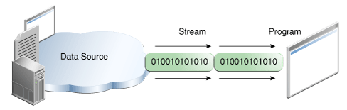

# 학습내용
- 스트림 (Stream) / 버퍼 (Buffer) / 채널 (Channel) 기반의 I/O
- InputStream과 OutputStream
- Byte와 Character 스트림
- 표준 스트림 (System.in, System.out, System.err)
- 파일 읽고 쓰기

 

## 스트림 (Stream) / 버퍼 (Buffer) / 채널 (Channel) 기반의 I/O
- I/O Streams  
  
  
  - 입력과 출력의 데이터 전송이 단방향으로 이루어짐
  - FIFO 구조를 지님

- Buffered Streams
  - 메모리 Buffer 영역을 사용하여 데이터를 읽고 씀
  - 필요한 시점에 Buffer에 쌓인 데이터를 한번에 처리

- 채널 (Channel) 기반의 I/O
  - Non Blocking I/O
  - 데이터가 지나가는 통로..?
  - 양방향의 입출력이 가능
  - buffer를 통해 읽거나 씀

 

## InputStream과 OutputStream
- byte stream 기반의 클래스들의 부모 클래스로, 추상 클래스임
- InputStream
  - AudioInputStream, ByteArrayInputStream, FileInputStream, FilterInputStream, ObjectInputStream, PipedInputStream, SequenceInputStream, StringBufferInputStream 의 서브 클래스가 존재
  ~~~java
  String filePath = "./study.txt";
  try(InputStream inputStream = new FileInputStream(filePath)){
      int i;
      while((i = inputStream.read()) != -1){
          System.out.write(i);
          // hello
          // kelly
      }
  }
  ~~~
  study.txt 
  ~~~txt
  hello  
  kelly  
  ~~~
- OutputStream
  - ByteArrayOutputStream, FileOutputStream, FilterOutputStream, ObjectOutputStream, PipedOutputStream의 서브 클래스가 존재
  ~~~java
  String filePath = "./study.txt";
  try(OutputStream outputStream = new FileOutputStream(filePath)){
      outputStream.write("HELLO".getBytes());
      outputStream.flush();
  }
  ~~~
  study.txt 
  ~~~txt
  HELLO  
  ~~~

 

## Byte와 Character 스트림
- Byte Stream
  - byte stream을 사용하여 8bit bytes의 입출력을 수행
  - 한번에 한바이트씩 처리
  - 더 이상 사용하지 않을 때, stream을 꼭 닫는 처리를 하여 리소스 누출을 방지
- Character Stream
  - 자바는 기본적으로 유니 코드 규칙을 사용하여 Character 값을 저장
  - byte stream의 속도가 더 빠르지만, 2byte의 유니코드를 다루기엔 byte stream보다는 charactor stream이 적절
  - Character Stream 클래스는 Reader 및 Writer 클래스를 상속받음
    - 대표적으로 FileReader, FileWriter가 있음
  ~~~java
  // FileReader
  String filePath = "./study.txt";
  try(FileReader reader = new FileReader(filePath)){
      int i;
      while((i = reader.read()) != -1){
          System.out.write(i);
          // hello
          // kelly
      }
  }
  
  // FileWriter
  String filePath = "./study.txt";
  try(FileWriter writer = new FileWriter(filePath)){
      writer.write("HELLO");
      writer.flush();
  }
  ~~~

 

## 표준 스트림 (System.in, System.out, System.err)
- 

## 파일 읽고 쓰기

