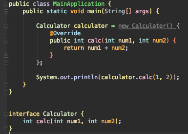
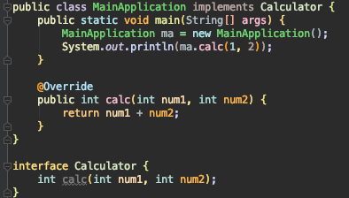
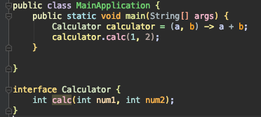
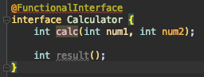
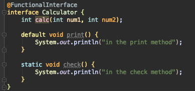
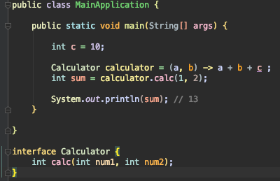

# 학습내용
- 람다식이란?
- 람다식 사용법
- 함수형 인터페이스
- Variable Capture
- 메소드, 생성자 레퍼런스

 

## 람다(Lambda)식이란?
- 메서드를 하나의 식(expression)으로 표현한 것
- 람다식은 메서드의 매개변수로 전달될 수 있고, 메서드의 결과로 반환될 수 있음
- 메서드를 변수처럼 다루는 것이 가능

 

## 람다식 사용법
- 한개의 추상메소드를 가지는 인터페이스가 필요
- (parameters) -> expression  
  (parameters) -> { statements; } 의 형태로 사용
- int calc(int num1, int num2) 메소드를 가진 인터페이스가 존재하는 경우,  
  기존 방식에서는 아래 2가지 방식으로 진행  
       
  람다식을 사용하면 아래와 같이 깔끔하게 작성 가능!  
   

 

## 함수형 인터페이스
- 단 하나의 "추상 메소드(abstract method)"를 갖는 인터페이스
- @FunctionalInterface 어노테이션을 사용하여 함수형 인터페이스라는 것을 명시 가능
- 하나 이상의 추상 메소드를 선언하면, compile error 발생
    
- 하지만!! java8 부터 인터페이스에 default/static 메소드를 가질 수 있으므로 해당 메소드들의 선언은 compile error가 발생하지 않음
    

 

## Variable Capture
- 람다식 외부에 존재하는 지역변수를 자유 변수(free variable)이라 함
- 람다식 내부에서 '자유변수'를 참조하는 행위를 variable capturing이라 함
- 람다식에서 참조하는 지역변수는 final 이거나 effectively final(final처럼) 동작해야 함
  - effectively final?
    - 초기화 된 이후 값이 한번도 변경되지 않았다면 effectively final 이라 할 수 있음
    - final 키워드가 붙어있지 않았지만 final 키워드를 붙힌 것과 동일하게 컴파일러에서 처리
  - 왜 final 이거나 final 처럼 동작해야할까?
    - 참조하는 지역변수를 관리하는 쓰레드와 람다식을 실행하는 쓰레드가 다른 경우,   
      지역변수의 변경이 일어나고 람다식을 실행하는 쓰레드에서 해당 값이 최신값인지 동기화된 값인지 알 수가 없어 기대하는 값과 다른 결과를 도출할 수 있음

- 람다식에서 참조하는 지역변수 값은 직접 참조가 아닌 복사본
  - 왜 복사본을 사용할까?
    - 지역 변수는 stack에 저장되고, 지역 변수가 선언된 블록이 끝나면 해당 변수값은 stack에서 사라짐
    - 따라서, 추후 람다식이 사용될 때 해당 값을 참조할 수 없으므로 복사본을 사용함
    - 지역 변수를 관리하는 쓰레드와 람다식을 실행하는 쓰레드가 다른 경우, 다른 stack을 가지고 있으므로 참조가 불가능한 이유도 있음

 

## 메소드, 생성자 레퍼런스
-
