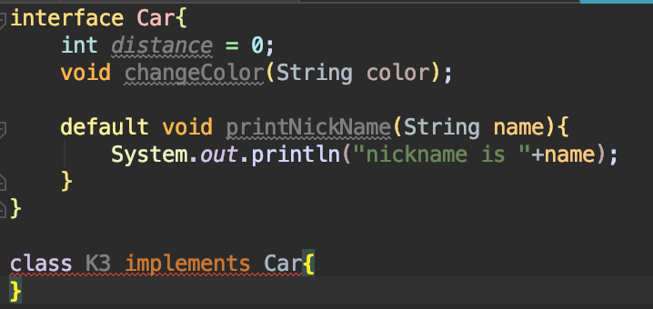
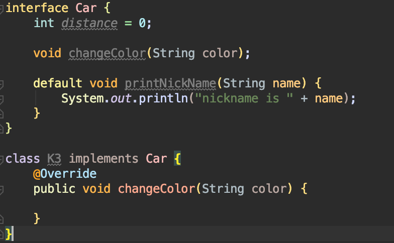

## 인터페이스 정의하는 방법
- 인터페이스란?
  - 클래스를 작성할 때, 기본이 되는 틀이 제공하고 규약을 정의하여 제공하는 것
  - 자바는 클래스의 다중 상속을 지원하지 않지만, 인터페이스의 다중 상속은 지원
- 클래스를 정의하는 것과 비슷하며 class 대신 interface 키워드를 사용
~~~java
public interface Car{
  int distance = 0;
  void changeColor(String color);
  
  default void printNickName(String name){
      System.out.println("nickname is "+name);
  }
}
~~~

 

## 인터페이스 구현하는 방법
- 구체화된 클래스명을 가진 클래스에 implements 키워드를 사용하여 구현
- implements 키워드에 의해 인터페이스를 상속받으면 컴파일러에 의해 인터페이스를 구현하라고 에러 발생
    
- 인터페이스에 선언된 메소드를 모두 오버라이딩
    
- default 메소드는 오버라이딩 하지 않아도 됨
- 필수 오버라이딩이 아니기 때문에, 공통적인 내용을 담고 있는 메소드로 많이 사용되며 필요한 경우에만 오버라이딩하여 사용할 수 있음

 

## 인터페이스 레퍼런스를 통해 구현체를 사용하는 방법

## 인터페이스 상속

## 인터페이스의 기본 메소드 (Default Method), 자바 8
- 인터페이스에서 default 키워드를 사용하여 메소드를 선언하면 메소드 내부를 구현할 수 있음
- defatul 메소드의 경우, 구현하는 클래스에서 메소드 오버라이딩이 필수가 아님

## 인터페이스의 static 메소드, 자바 8

## 인터페이스의 private 메소드, 자바 9
